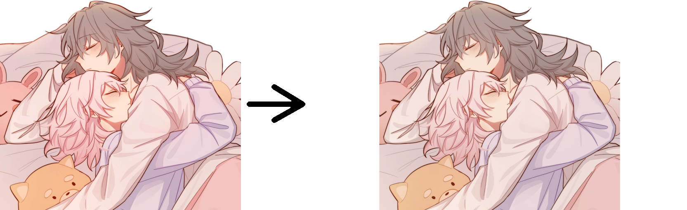
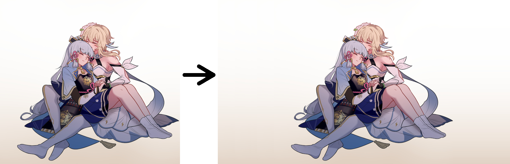

# Letterboxinator

Letterboxinator is a program that can change the ratio of an image without cropping it. It can fill the resulting empty space in three ways; using a blurred version of the origional image, using a specified color, or by repeating the edge pixels. All this is easily done through a graphical user interface, where you just drag and drop your image, and a letterboxed version of the image is placed in the same folder.

## Examples
Note that all the examples here showcase a ratio of 16x9. The program can handle any ratio, including vertical ones, but 16x9 is the most common use case.

### Blur

<figure>
    
    <figcaption>Origional image on the left, same image in 16x9 with blured background on the right. Image is of my cat.</figcaption>
</figure>

### Color

<figure>
    
    <figcaption>Origional image on the left, same image in 16x9 with colored background on the right. Image is by <em>riejiu</em>, available on <a href="https://twitter.com/riejiu/status/1653036277581905920">twitter</a>.</figcaption>
</figure>

### Extend

<figure>
    
    <figcaption>Origional image on the left, same image in 16x9 with edges extended on the right. Image is by <em>Yuutama2804</em>, available on <a href="https://twitter.com/Yuutama2804/status/1649412768733208576">twitter</a>.</figcaption>
</figure>
